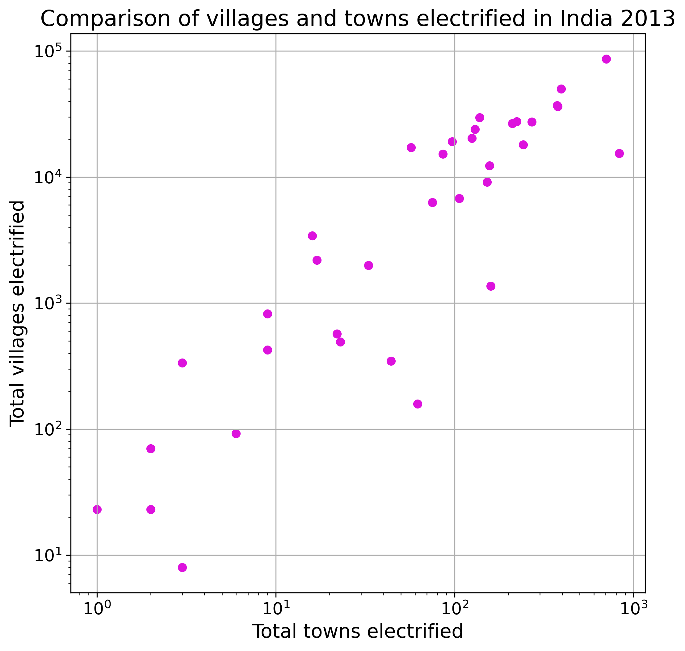
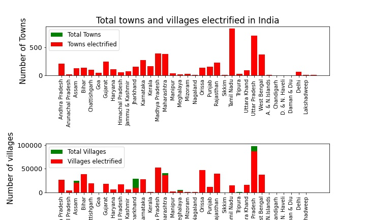
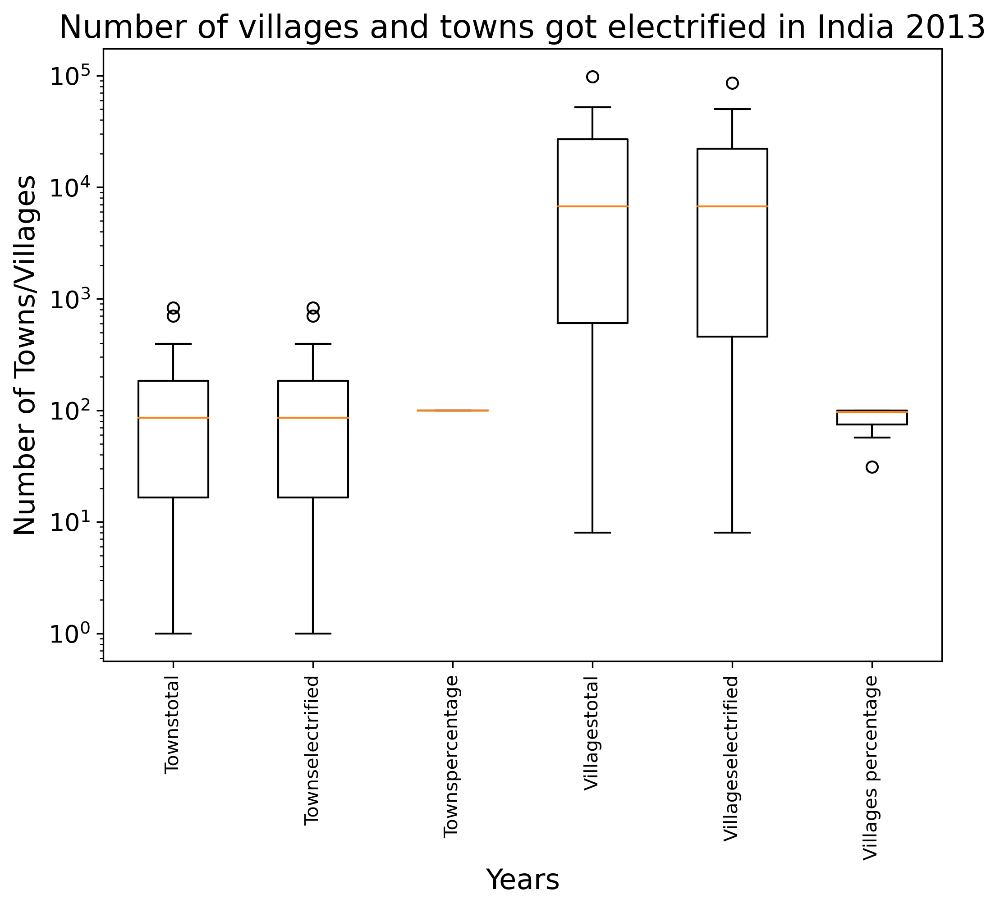

# DS200: Research Methods (Module 4)

## Assignment Report

> **Visualization of dataset using barplot, scatter plot and block plot. **

The dataset used in this report is 'Number Of Towns And Villages Electrified In India' from https://data.gov.in. The link to the dataset is https://data.gov.in/resources/number-towns-and-villages-electrified-india. This presents the number of villages and towns in India got electrified completely with percentages. The analysis has been carried out with the help of bar plot, scatter plot and box plot as given in below sections.

## Documentation
1. The script for generating the plots is given by jupyter notebook named ```ds200.ipynb```.
2. The png files of the plots are located in ```figures/``` directory.
3. The dataset is located in the form of a .xls file in the folder ```datasets/elect.xls```.
4. The libraries used are ```numpy```, ```pandas```, and ```matplotlib```. 

## Analysis of plots

### Scatter Plot


By plotting number of villages electrified in y-axis and number of villages electrified in x-axis, one can see the correlation between the two. The given plot is plotted in logarithmic scale.  One can observe a linear correlation between number of villages and towns got electrified.

### Bar Graph


The bar plot shows the number of villages and towns got electrified for each state with total number of villages and towns in two sub figures respectively. One can see that there is no town left which is not electrified. Electrification of villages is still left and in that Jharkhand state has least number of electrified villages compared to total villages.

### Box Plot


It can be observed from the boxplot that the median values of the percentage of towns electrified is same as mean and its value is 100%. This shows the development of India with respect to electrification is completed in urban regions. Whereas, villages are still lagging in electrification as shown by the median of bar plot. The six catogeries observed in the bar plot are total towns, towns electrified and its percentage, total villages, villages got electrified and its percentage.

### Conclusion
To summarize the results, a logarithmic relation between the number of villages electrified and number of towns electrified in each state was obtained. It was noted that all the states have 100% electrification in towns. States like Jharkhand, Arunachal Pradesh, Bihar etc. have lower percentage of electrification in villages. Thirteen states have complete electrification in both towns and villages.

